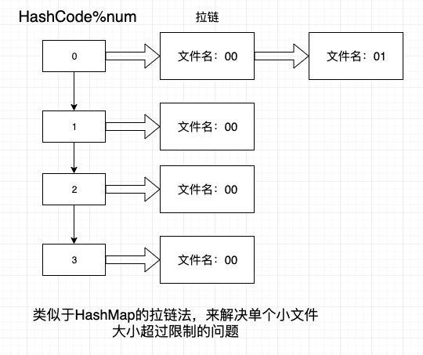

# TopKRateOfURL

题目：100GB url 文件，使用 1GB 内存计算出出现次数 top100 的 url 和出现的次数

默认一行为一个url

## 分片思路：

num=文件大小(大文件100G) / 内存限制(1G)

字符串的HashCode对num取余，如果某个文件超过内存限制，利用拉链法解决。

## 归并思路：

将单个文件利用分布式统计url出现频率后，归并到同一个机器上，计算top100。

1. 问题一：统计频率之后，归并时会不会出现url重复率很低，而导致OOM？答：如果重复率很低，大概率不会有很多的哈希冲突。

2. 问题二：取TopK时，可不可以考虑使用快排利用基准获取TopK？答：在算法的角度考虑，堆排序平均时间复杂度是O(NlogN)，快排优化取TopK的时间复杂度是O(N)。可以考虑用快排实现，由于时间原因，还未手动实现。
